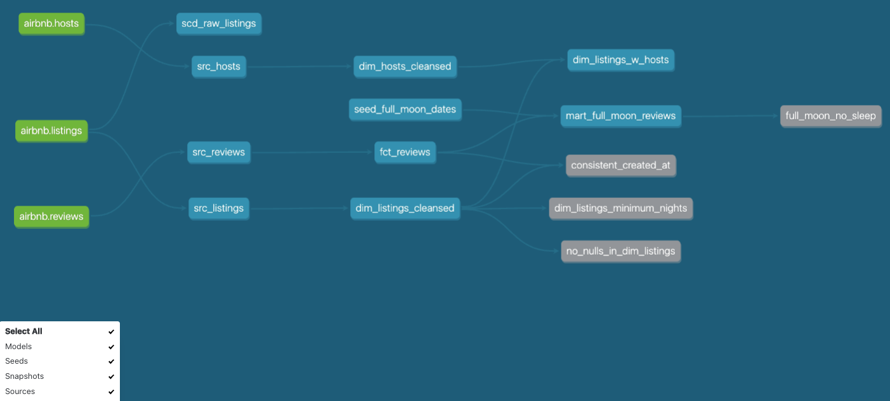

# dbt-exploration

A little hands-on session with dbt and Snowflake. 

## Why dbt

DBT's models and built-in testing + documentation mechanisms make it easy to do a lot of intermediary processing work that would otherwise require more tools. 

## The what

This mini dbt-exploration was done with the purpose of taking some source data (listings, hosts, reviews in this case), doing a bit of cleanup and producing datasets meant for analytics dashboards.

The entire lineage can be summarized as follows:



## Setup

The pre-requisites and data that is used here is pretty simplistic. It starts off with some data pulled from Airbnb for hosts, listings, and reviews,
placed in the source directory - which is to be imported into Snowflake.

Start off by installing dbt in a virtual environment. Next, set up the [profile.yml](https://docs.getdbt.com/docs/core/connect-data-platform/profiles.yml) which contains the connection information to the source database (in this case, snowflake)

The source data is contained in the data_sources directory.

All the models, tests, analyses, etc written for dbt can be found in the _dbt_arjun_ directory.

## dbt specific initialisation

- Switch to the project directory and run `dbt init`. (dbt_arjun in this case). This requires that a profile is set up. 
- Run models with: `dbt run` or selected by supplying `-s` or `--selected`
- Run tests with: `dbt test` or selected by supplying `-s` or `--selected`

## Orchestration

This was unexplored, but could easily be done with any orchestration tool such as Airflow, dagster etc. Here's a rough sketch of how to go about it:
```
Dockerfile: 
Regular Airflow pull
install:
gcc
python3-dev


Set DBT_PROFILES_DIR
Put all DBT stuff in a dir and copy it over.

Add to requirements:
astronomer-cosmos[dbt.all]

Copy profiles.yml

# install dbt into a venv to avoid package dependency conflicts
WORKDIR "/usr/local/airflow"
COPY dbt-requirements.txt ./
RUN python -m virtualenv dbt_venv && source dbt_venv/bin/activate && \
    pip install --no-cache-dir -r dbt-requirements.txt && deactivate

dbt-requirements.txt:

dbt-core==1.3.1
dbt-postgres==1.3.1


See: https://robust-dinosaur-2ef.notion.site/Cosmos-1017615a1b9041e5827be017d4fd574b
```